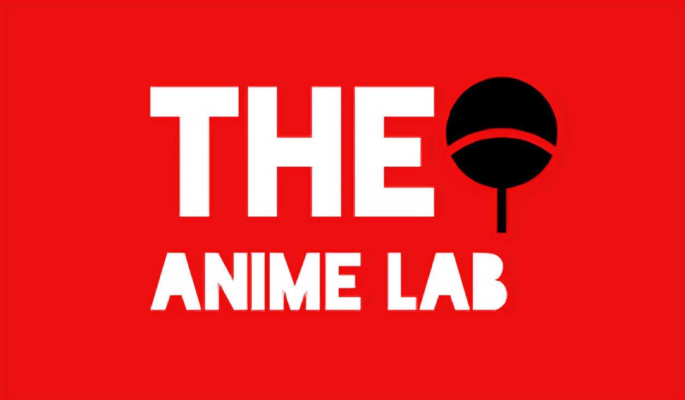

# The Anime Lab

Welcome to **The Anime Lab**, an advanced anime recommendation system that leverages NLP and collaborative filtering to suggest anime based on your preferences. Whether you're a casual viewer or an anime enthusiast, The Anime Lab helps you discover new shows tailored to your taste.



## Features

- **Personalized Recommendations:** Get anime suggestions based on your viewing history and preferences.
- **NLP-Based Filtering:** Recommendations are refined using Natural Language Processing to understand anime descriptions, reviews, and more.
- **Collaborative Filtering:** Uses data from other users with similar tastes to enhance your experience.
- **User-Friendly Interface:** Easily navigate through recommended anime with a sleek and modern UI.

## Tech Stack

- **Frontend:** HTML, CSS
- **Backend:** Flask, Python
- **Machine Learning:** NLP, Collaborative Filtering
- **Database:** SQL
- **Deployment:** Vercel

## Getting Started

### Prerequisites

- Flask
- Python 3.x
- Xampp server for backend

### Installation

1. Clone the repository:

   ```bash
   git clone https://github.com/your-username/the-anime-lab.git
   ```

2. Navigate to the project directory:

   ```bash
   cd the-anime-lab
   ```

3. Install the dependencies:

   ```bash
   pip install -r requirements.txt
   ```

6. Run the development servers:

   ```bash
   # Frontend
   python anime_api.py

7. Open your browser and go to `http://localhost:5000` to explore The Anime Lab!

## Contributing

We welcome contributions from the community! Check out the [Contributing Guidelines](CONTRIBUTING.md) to get started.

## Contact

For any inquiries, feel free to reach out via [Gaurav](gauravsingh96753@gmail.com).

